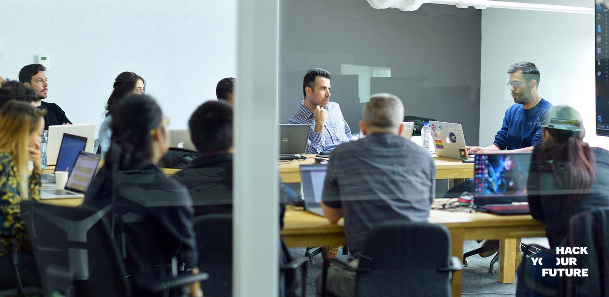
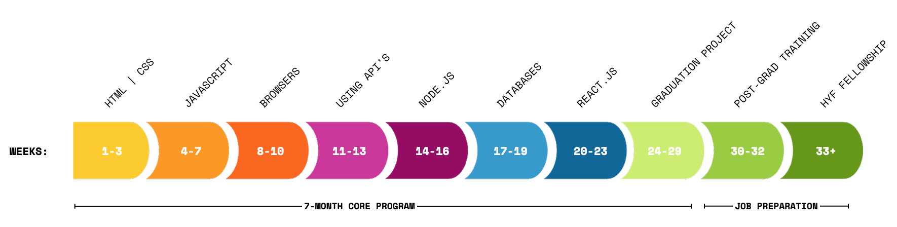

# Introduction for new mentors

Welcome to HackYourFuture! We really appreciate your interest in being part of our community. In this repo, you'll find an overview of the different volunteering positions available. By volunteering, you contribute to our main goal: help trainees gain the necessary skills to find a job as a programmer. HackYourFuture has now helped over 300 trainees find work as a programmer. This is only possible with the support of our volunteers <3

In order to reach this goal, we focus on two main areas: the coding skills and social job readiness. For the coding skills, we cover the basic of Javascript so that the graduates can apply to positions in frontend, backend and fullstack. Aside from teaching how to use the language, we also train participants in writing clean code and working in teams on a code. Regarding the social skills, we pay attention to communication skills, teamwork, English but also give training in interview preparation and CV building workshops.

## Tech mentors

### Curriculum

To facilitate the learning process, volunteers together with HYF staff have developed a curriculum, which you can find [here](https://github.com/HackYourFuture/curriculum). The complete 7-month program is divided into different modules, each building on the one before. We encourage you to have a look at the curriculum and think about which modules connect most to your professional experience. Another useful resource is the [Study Manual](https://docs.google.com/document/d/1YzPC7m9vOCb0h4EFCqLChw1L096XcbJv3dK3k7VooQM/edit?usp=sharing), which we give to trainees on their introduction day. It provides an overview of our program. 

### Structure
Every two to three months, a new cohort of +/- 15 trainees starts the course. This means that we have about 4 cohorts (+/- 55 trainees) in different stages of the curriculum at any given point. HackYourFuture is mostly a self-study program and you can find the structure for our trainees [here](https://docs.google.com/document/d/1JUaEbxMQTyljAPFsWIbbLwwvvIXZ0VCHmCCN8RaeVIc/edit?usp=sharing). On Sundays (12:00 to 14:30), we host online Q&A sessions for each cohort, that tackles the weekly material.
As a volunteer, you either help out per module, or as 1-1 coach with a single trainee. Modules are between three to four weeks long (except for GIT/CLI, which is only one session). So we ask volunteers to commit for about three weeks to HYF. It’s up to you how often you want to help out with a module. We need at least three mentors per module. Check the table below for an overview and explanation of the different volunteering roles.  

### Roles
| Role              | Topic                                 | Time estimation per week |
| ------            | --------------------------------------| --------------- |
| [Assignment support](./assignment-support)  | As an assignment mentor, you check and provide feedback on the weekly assignments of the trainees. We split the cohort into groups, so that you have about 3-5 trainees to review per module. Feedback should be provided within a week after the assignment has been submitted. Once their assignment corrected, the trainee have themselves a week to implement your feedback, so that you can do a last check-up. This is their chance to get personal feedback on their code, so the focus shouldn't be restricted to whether the answer is correct, but also on their coding style, whether their are cleaner solutions and responsiveness to feedback. | 2-4 hours. Flexible |
| [(Online) Q&A lead](./online-teaching)   | On Sundays, you host a Q&A session for the module of your choice. Trainees must submit their questions by Saturday 16:00 so that you have time to prepare. They also need to complete a preparation exercise that tackles the weekly material, which you can also address during the session (for example, asking trainees to present and compare their solutions helps to make the session interactive). What is very helpful is if you can also give a brief lecture to summarise the weekly concepts, however that is optional. To become a Q&A lead, you must first have experience as Assignment Support. Afterwards, you’ll help out a more experienced mentor for a module, so you learn how to lead a session. Most Q&A leads also do assignment review for the module. | 3-5 hours including the session and preparation time. |
| [Personal mentor](./coding-mentor)      | Some of our trainees need additional support throughout the program to be ready for their first job. This is exactly what you do as a personal mentor. We ask you to organize at least one, but preferably two video calls per week, of at least an hour, when assigned to a trainee. |4 hours. Flexible |
| [Project leader](./project-leader)      | There are multiple short projects in the curriculum that require guidance. As project leader, you provide this guidance by acting like a Tech lead / Product owner / Scrum master in one | 7 hours, 1 week |
| [Post Graduation Package](https://github.com/HackYourFuture/post-grad-ed/blob/master/mentoringpgp.md)        |  As a mentor, you work closely with two graduates who are preparing for their first internship. You support them in a 4 to 8 weeks program.           | 3 hours. Flexible |
|[English Mentoring](https://github.com/HackYourFuture/mentors/tree/main/english-mentor)|  As an English Mentor you help the trainees improve their english languages skills so they are more ready to work in a professional envirnment. You support them for aprox 1 hour a week for a period of 12 weeks| 1 hour. Flexible |

## Social skills mentors

## Communication
Most of our communication is done via Slack. This is the place where we ask you if you can help out with a certain module, and where you can keep in touch with both trainees and other mentors.
Next to that, we have channels for each cohort and the main goal here is to support trainees with questions or their assignment during the week. If you are not in Slack yet, ask Joséphine :information_desk_person:

## What we expect from you

For an overview and explanation of our core values, check out [this](https://github.com/HackYourFuture/values) repo. 

For you, the mentors, it's important to know that you're a role-model for our trainees. They can learn by example to:
* Stick to deadlines
* Communicate professionally and on time
* Be proactive

# Conclusion
We hope that by reading this, you have a better idea of what it means to volunteer at HackYourFuture. If you have any question, you can always send us an email at josephine@hackyourfuture.net or (once you have been added to our Slack channels) send us a Slack message.

Looking forward to working with you!

